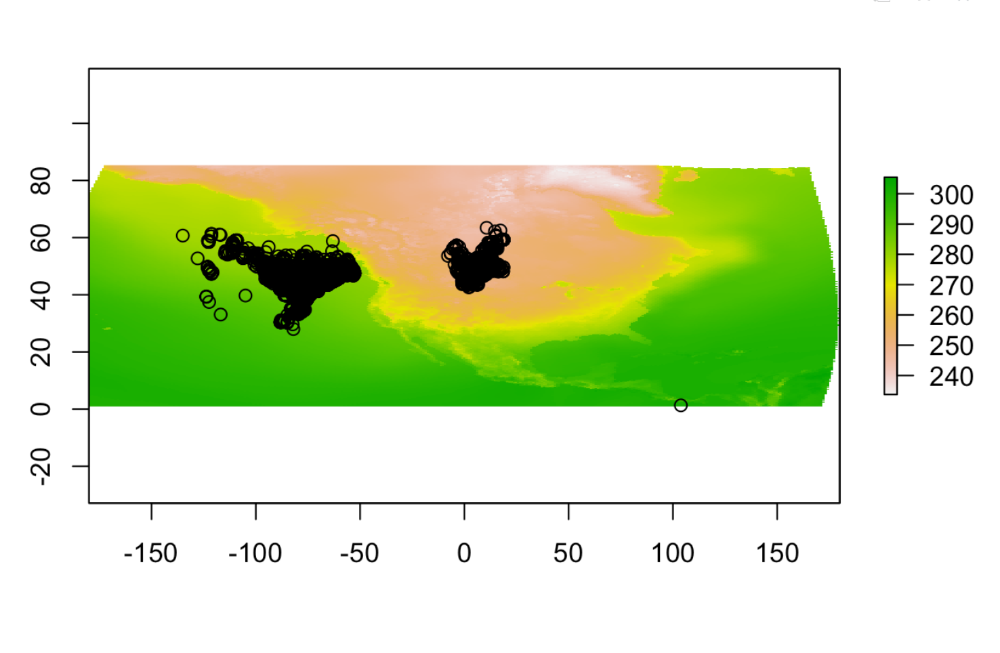
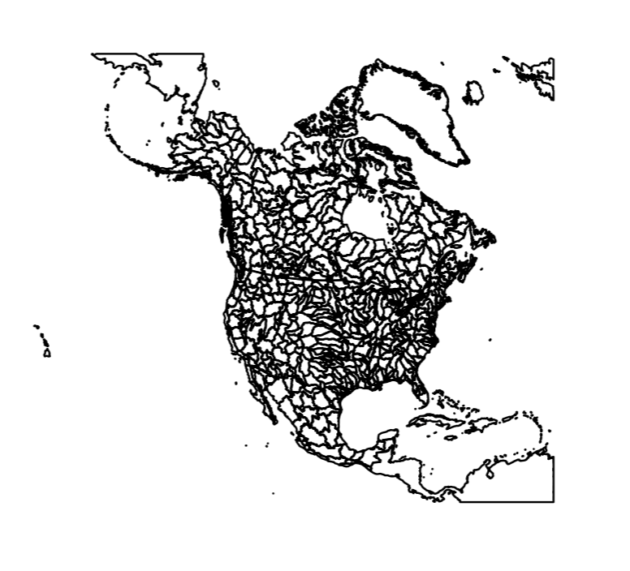

```{r setup, include=FALSE}
knitr::opts_chunk$set(echo = TRUE)
```


## Your assignment

The goals for this assignment are to:

- practice making maps with the various packages
- think about composition and the grammar of graphics
- critique various maps

_By the end of the assignment_ you should have several static maps displaying the datasets we've used in the last few weeks.

# Task 1: Show me your ugly maps!!
Find 2 examples of maps that you think are 'bad'. 





_Question 1_ Why are they bad? What might improve them? 

- The bad maps are maps I plotted from my mini project.  The first map the CRS are off, the points are in the ocean, the map is stretched, and the colors are horrible.  Also the scale/key isn't labeled so no one knows what the colors or points are.  To improve this map I would label the points (with smaller dots) and include units on the key.  I would also work on cropping so that the extra space was eliminated.  Lastly, I would change the colors to be more appealing.

- The second map has not text, no labels, no colors and it is really busy.

_Question 2_ Rely on the Healy and Wilke texts to provide some structure to your answers.

- In general these figures have aesthetic problems, are unclear, and are objectively incorrect because the wrong CRS.

# Task 2: Load your libraries and build a dataframe
You can choose whichever datasets you'd like from the past several months as the subject for your mapping. You'll need to use at least one tabular join, one spatial join, and one extraction to create the dataframe. Load the packages, the data, and make sure everything is projected here. Give me a sense for what you are hoping to map.

```{r packages}

library(tidycensus)
library(tidyverse)
library(pander)
library(sf)
library(terra)
library(units)
library(purrr)
library(sp)
library(profvis)
library(ggmap)
library(cartogram)
library(patchwork)
library(tmap)
library(viridis)
library(tigris)

```

- I am going to map mammal richness and state income and see which effects state park visits the most.  Do parks in states with higher incomes get more visits (more money to travel and have fun) or states with higher mammal richness because there are more interesting animals to see?

```{r data}

#one tabular join
#one spatial join
#one extract

#mammal richness for the western us (raster)
mammal.rich <- rast("/opt/data/session16//Mammals_total_richness.tif")
mammal.rich <- catalyze(mammal.rich)
mammal.rich <- mammal.rich[[2]]

#median income by state (spatial)
state.income <- tidycensus:: get_acs(geography = "state", 
              variables = c(medianincome = "B19013_001"),
              year = 2018,
              key = key,
              geometry = TRUE)

st_make_valid(state.income)

#park names and visits in the intermountain west (tabular data, can join by state)
park.visits <- read.csv("/opt/data/session14//ParkVisits_2020IWPW.csv", skip = 3)

#look to see what I can join by
#need to add info to park visits file so that I can merge by the same name
colnames(park.visits)
colnames(state.income)

data(fips_codes)
str(state.income$NAME)
fips_codes1 <- fips_codes[, -c(4:5)]
fips_codes1 <- unique(fips_codes1)
str(fips_codes1$state_name)
state.income.fips <- dplyr::left_join(state.income, fips_codes1, by = c("NAME" = "state_name"))

#check everything
st_crs(state.income.fips) == st_crs(mammal.rich)

#need to join the tab data (park visits) with the sf object (state income)
park.visits$RecreationVisits <- parse_number(park.visits$RecreationVisits)

stateparkvisits <- park.visits %>% group_by(State) %>% mutate(., visits_by_state = sum(RecreationVisits, na.rm = TRUE)) %>% distinct(., State, .keep_all = TRUE)

df <- state.income.fips %>% 
  left_join(., stateparkvisits, by = c("state" = "State"))

##now I need to extract mammal richness from the raster and add it to my new dataframe
st_crs(df) == st_crs(mammal.rich)

df.vec <- vect(df)
ric.crop <- crop(mammal.rich, df.vec)
rich <- terra::extract(ric.crop, df.vec, fun = mean)

dim(df.vec)
dim(rich)

#add the data back to my df

names(rich)[2] <- "richness"
df <- add_rownames(df)
rich <- add_rownames(rich)

df.summary <- left_join(df, rich, by = c("rowname" = "rowname"))
head(df.summary$visits_by_state)
```


# Task 3: Build a map with Tmap
Practice making a quick map with tmap. 

```{r tmap}
#visits to parks by state in millions
tm_shape(st_as_sf(df.summary)) + tm_polygons(col = "visits_by_state",  border.col = "white") + 
  tm_legend(outside = TRUE)


tm_shape(ric.crop) +
  tm_raster("Value", palette = viridis(n=50), n=50, legend.show=FALSE, legend.hist = TRUE, legend.hist.title = "Species Richness") +
tm_shape(st_as_sf(df.summary)) +
  tm_polygons(col = "estimate",  border.col = "white", title="Mean Income") + 
  tm_legend(outside = TRUE)


```


# Task 4: Build a choropleth with ggplot
Your map should have a basemap, should rely on more than one aesthetic (color, transparency, etc), and combine multiple layers.

```{r chloromap}


```


# Task 5: Build 2 cartograms
Follow the examples to build cartograms that display your region of interest based on variables other than area.

```{r cart}

```


_Question 3:_ Reflect on the different maps you've made, what do the different visualizations tell you about the data you plotted?

- 

_Question 4:_ How might you improve the maps you've made?

- 

_Question 5:_ Is a map the best way to evaluate the data you worked with? Why or Why not?

- 
